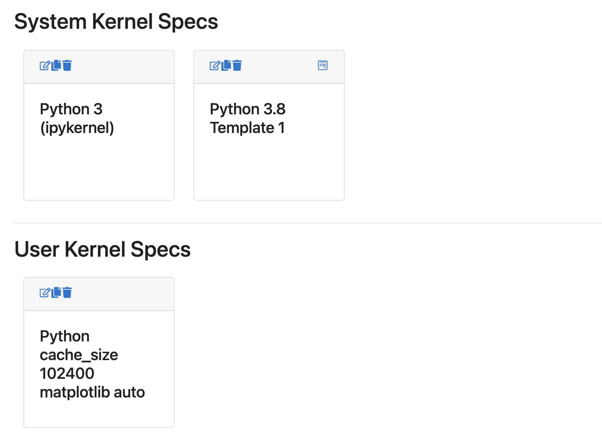

# Kernel Specification Manager JupyterLab Extension

# Name

`ksmm` is a temporary name, originally standing for `Kernel Spec Manager Manger`

This Jupyter Extension allows users to edit specific components of their IPython Kernels from within Jupyter.

Current Features:

- Kernel Editing: name, attributes.
- Kernel Duplication. 
- Kernel Deletion.

Not implemented yet:

- "New" Kernel Additions.

# Goal

On large distributed systems, it is common to wish to parametrize kernels and
chose parameters for a remote environment, like number of CPU, Memory limit,
presence of GPU. Or even set other parameters in environment variables.

This currently requires to create a new kernelspec for jupyter using the command
line which can be a tedious and complicated task.

Modifying existing kernelspec also does not always works as they are cached on a
per notebook.

This is an attempt to provide a UI based on json-schema and templates, for end
users to easily create, duplicate and modify kernelspec, without being exposed
to _too much_ of the internal details.

The current goal would be to provide an editor for kernelspec that would
given a kernelspec template like the following.

```json
# kernelspec template
{
  "cmd": [
    "slurm", "run", "--mem={mem}", "--cpu={cpu}", "python3.8", "-m", "ipykernel"
  ],
  "title": "Python 3.8 {mem}/{cpu}",
  "params": {
    "mem": ["100G", "500G", "1T"],
    "cpu": { "min": 1, "max": 300}
  }
}
```

Generate a kernelspec modification UI with a Dropdown for the memory with
available values, and for example a slider for the CPU.

This would let non-technical user in for example JupyterHub to quickly modify
Kernelspecs.

## Running from Source

Use the provided environment.yaml to install the conda environment.

```base
conda deactivate && \
  make env-rm && \
  make env
conda activate ksmm
```

```python
# Install the server and frontend in dev mode.
make install-dev
```

```python
# In terminal 1, start the extension building in watch mode.
make watch
```

```python
# In terminal 2, Start the jupyterlab in watch mode.
# open http://localhost:8234?token=...
make jlab-watch
```

# Installing the Server Extension

```bash
pip install ksmm
```

This will install the extension inside the current JupyterLab Environment. This is typically the
latest release from the main branch. 

### Screenshots

Below are screenshots from the usage of the application.

##### Home Screen



##### General Settings


##### Launch Arguments


